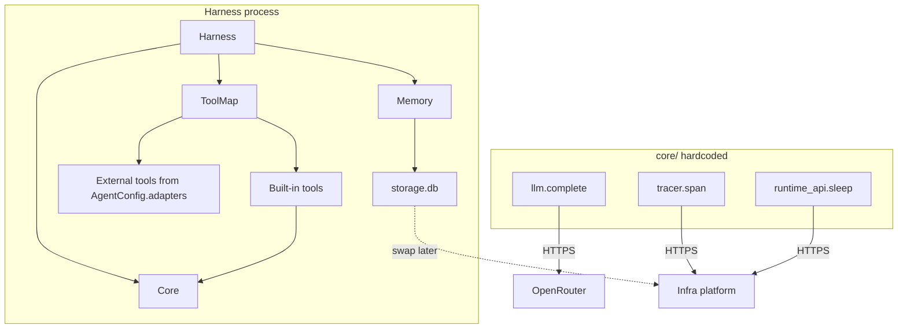
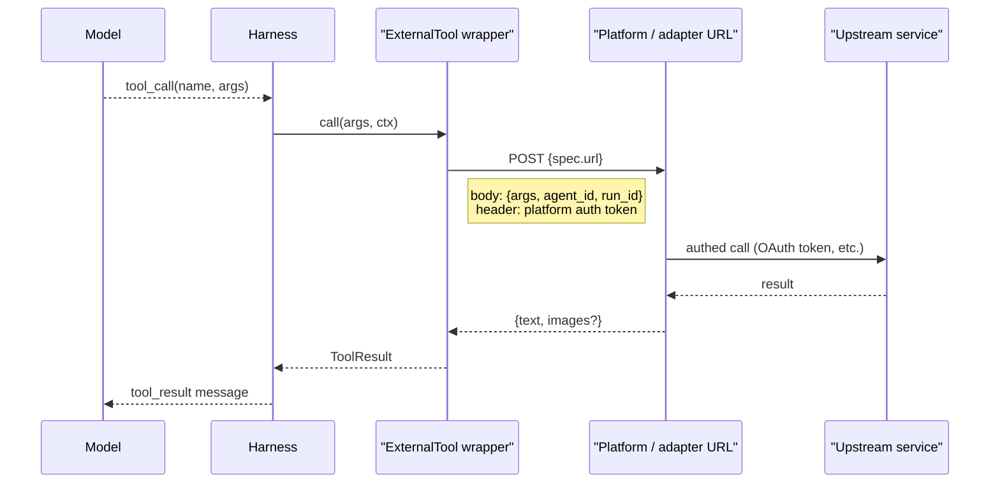

# Harness

A runnable agent harness designed for fast iteration without requiring changes to surrounding infrastructure, tools, or adapters. `Harness` takes an `AgentConfig`, loops against OpenRouter, dispatches tools (built-in + external via adapters), and persists state to SQL.

Harness is always paired with a **cloud infrastructure platform** that owns deployment and durable state. Every run — local or deployed — streams its logs, traces, and eval results to that platform, so local dev and production share one source of truth.

## Local usage

The repo has two main local workflows:

1. A self-contained demo + test loop that uses the fake platform and local sqlite.
2. Real harness runs and evals that still talk to Bedrock, OpenRouter, and Turso.

### Install dependencies

```bash
uv sync --dev
```

The CLI auto-loads `.env` from the current working directory if it exists.

### Environment

For the self-contained demo, you only need:

```bash
OPENROUTER_API_KEY=...
```

For `harness agent` and `harness eval`, set:

```bash
OPENROUTER_API_KEY=...
BEDROCK_TOKEN=...
HARNESS_TURSO_PLATFORM_TOKEN=...
HARNESS_DATABASE_TOKEN=...

# Optional overrides
BEDROCK_URL=http://127.0.0.1:8000
HARNESS_TURSO_ORG=bryanhoulton
HARNESS_TURSO_GROUP=default
```

Notes:

- `BEDROCK_URL` defaults to `http://127.0.0.1:8000`.
- The CLI requires real Bedrock/Turso/OpenRouter credentials even for evals.
- The demo script does not need Turso; it writes sqlite files under a temp directory.

### Fastest local check

Run the demo if you want one end-to-end harness run without depending on Bedrock or Turso:

```bash
uv run python scripts/run_demo.py
```

What it does:

- Starts `tests/fake_platform.py` in-process.
- Registers fake weather + SMS tools.
- Uses local sqlite storage.
- Makes real OpenRouter calls.

### Run tests

Default test suite:

```bash
uv run pytest
```

Tiered-memory tests are excluded from the default suite because they make heavier live LLM calls:

```bash
uv run pytest tests/memory -o "addopts="
```

Live Turso integration tests are opt-in:

```bash
RUN_LIVE_TURSO=1 uv run pytest tests/integration -o "addopts="
```

Important testing behavior:

- LLM tests use real OpenRouter calls.
- `OPENROUTER_API_KEY` missing is a hard failure, not a skip.
- The normal test suite clears Bedrock/Turso env so tests do not accidentally hit real services.

### Run a real harness agent

Run an existing Bedrock agent:

```bash
uv run harness agent <AGENT_UUID> --bedrock-token "$BEDROCK_TOKEN"
```

Or auto-create a dev agent for the single visible product:

```bash
uv run harness agent --bedrock-token "$BEDROCK_TOKEN"
```

Useful flags:

- `--local` to force `BEDROCK_URL=http://127.0.0.1:8000`
- `--product <uuid>` when your API key can see multiple products
- `--model <slug>` to override the configured model
- `--reasoning-effort low|medium|high`
- `--system-prompt "..."` when auto-creating a dev agent

There is also a lower-level live-run helper if you already have an agent id and want a more explicit script entrypoint:

```bash
uv run python scripts/run_live.py <AGENT_UUID> --bedrock-token "$BEDROCK_TOKEN"
```

### Run evals

The quickest eval is:

```bash
uv run harness eval smoke --bedrock-token "$BEDROCK_TOKEN"
```

Example with an explicit model override:

```bash
uv run harness eval group-lunch-memory --bedrock-token "$BEDROCK_TOKEN" --model claude-haiku-4-5
```

How evals work locally:

- They use in-process fake adapters for email, SMS, contacts, and computer actions.
- They still create a real eval agent in Bedrock.
- They still use OpenRouter for model calls and Turso/libSQL for storage.
- Results are summarized to stdout and the CLI prints the Bedrock agent URL at the end.

Available scenario names right now:

- `smoke`
- `group-lunch-fresh`
- `group-lunch-memory`
- `multi-stakeholder-scheduling`
- `preference-channel-fidelity`
- `blue-red-shoes-light`
- `blue-red-shoes-medium`
- `blue-red-shoes-heavy`
- `curl-wget-light`
- `curl-wget-heavy`
- `draft-before-send-heavy`
- `thursday-no-meetings-heavy`
- `vegetarian-restaurant-heavy`
- `vending-bench`

## Architecture




The `core/` layer is hard-coded. To try a different LLM or tracer implementation, branch the repo, edit the file, pin to that commit. No plugin system, no DI container.

## Repo layout

```
harness/
  pyproject.toml
  uv.lock
  README.md
  src/harness/
    __init__.py            # Harness, AgentConfig, AdapterConfig, ExternalToolSpec
    harness.py             # Harness class + main loop
    config.py              # AgentConfig, AdapterConfig, ExternalToolSpec
    context.py             # RunContext + agent_id contextvar
    constants.py           # MAX_TURNS, summary cadences
    core/
      storage.py           # load(), flush(), db (sqlite3.Connection)
      tracer.py            # span() context manager, POSTs to platform
      llm.py               # OpenRouter client -> LLMResponse with usage+cost
      runtime_api.py       # sleep() -> POST to platform
    tools/
      base.py              # Tool protocol, ToolResult
      sleep.py             # SleepTool (built-in)
      external.py          # ExternalTool: POSTs args to spec.url
      registry.py          # build_tool_map(adapters)
    memory/
      service.py           # MemoryService: build_llm_inputs, log_messages, nudge
      context.py           # MemoryContextBuilder.fetch_data + render
      summarizer.py        # SummaryUpdater: 1m -> 5m -> hourly -> daily -> weekly -> monthly
      marks.py             # mark/window math, tz/DST handling
      bucketing.py         # minute/5m/hour bucket math
      rows.py              # typed row dataclasses
      types.py             # PeriodType + per-tier prompt metadata
      migrations/          # 0001_initial.sql, 0002_tiered_memory.sql, ...
  tests/
    fake_platform.py       # local HTTP server implementing the platform contract
    conftest.py            # shared fixtures
    memory/                # tiered memory tests
    test_*.py              # package-level tests
  scripts/
    run_demo.py            # end-to-end demo with fake platform + mock SMS adapter
```

## Config

```python
@dataclass(frozen=True)
class ExternalToolSpec:
    name: str
    description: str
    parameters: dict
    url: str                     # absolute URL harness POSTs args to
    timeout_seconds: float = 60.0

@dataclass(frozen=True)
class AdapterConfig:
    name: str
    description: str
    tools: list[ExternalToolSpec]

@dataclass(frozen=True)
class AgentConfig:
    id: str
    model: str                   # OpenRouter slug
    system_prompt: str
    adapters: list[AdapterConfig] = field(default_factory=list)
    reasoning_effort: str | None = None
```

Entry point: `Harness(config: AgentConfig, run_id: str).run() -> None`. Infra generates `run_id`.

## Harness loop

Each turn ends in at least one tool call (`tool_choice="required"` is hardcoded), so the harness never stalls on a text-only reply. The loop terminates when the model calls the built-in `sleep` tool, which signals infra to stop the container.

```python
class Harness:
    def __init__(self, config: AgentConfig, run_id: str):
        self.config = config
        self.ctx = RunContext(agent_id=config.id, run_id=run_id)
        self.tool_map = build_tool_map(config.adapters)
        self.memory = MemoryService(agent_id=config.id, model=config.model)

    def run(self) -> None:
        set_agent_id(self.config.id)
        storage.load(self.config.id)
        try:
            with tracer.span("run", agent_id=self.config.id, run_id=self.ctx.run_id):
                for turn in range(MAX_TURNS):
                    self.ctx.turn = turn
                    with tracer.span(f"turn_{turn}"):
                        if not self._step():
                            return
        finally:
            storage.flush()
```

## Tools

`src/harness/tools/base.py`:

```python
class Tool(Protocol):
    name: str
    description: str
    parameters: dict
    def call(self, args: dict, ctx: RunContext) -> ToolResult: ...

@dataclass
class ToolResult:
    text: str
    images: list[bytes] | None = None
```

Built-in tools are real classes in `tools/`. External tools are wrapped by `ExternalTool(spec)`, which satisfies the `Tool` protocol by POSTing args over HTTP. `Harness.__init__` builds one `tool_map: dict[str, Tool]`; a name collision between a built-in and an external raises.

### External tool invocation

The URL is whatever the platform registered in `AgentConfig` — typically a platform-owned proxy endpoint that handles auth and dispatches to the real adapter (Slack, Gmail, etc.), but it could also be a direct webhook. Harness never knows which upstream system a tool talks to.




Wire format:

- **Request:** `POST {spec.url}` with JSON body `{"args": {...}, "agent_id": "...", "run_id": "..."}` and headers `Authorization: Bearer $BEDROCK_TOKEN`, `Content-Type: application/json`.
- **Response:** `200` with JSON `{"text": "...", "images": ["<base64>", ...] | null}`.
- **Non-2xx JSON error:** body is surfaced to the model verbatim — `ToolResult.text` is the JSON-stringified response body. This lets the model reason about and recover from real upstream errors.
- **Non-2xx non-JSON error:** falls back to `"<status> <reason>: <text-truncated>"`.
- **Timeout:** becomes `ToolResult.text = "timeout after Ns"`, using `spec.timeout_seconds` (default 60s).
- The `tool_call` span records HTTP status and error body in metadata.

Auth, rate limiting, retries, and proxying are the platform's responsibility.

## Sleep / wake

`SleepTool.call` posts to `/agents/{agent_id}/sleep`. Not run-scoped — sleep is about the agent; any in-flight run just exits. The tool returns a confirmation `ToolResult` and sets `ctx.sleep_requested = True` → `_step` returns `False` → `run` exits cleanly. Infra schedules the next wake and spins a new container.

## Storage

`core/storage.py` exposes:

- `db: sqlite3.Connection` — module-level, opened by `load()`.
- `load(agent_id: str) -> None` — opens `/tmp/{agent_id}.sqlite`, applies migrations.
- `flush() -> None` — called before process exit.

Memory code uses SQL directly against `db`. The swap point is `core/storage.py` only — moving to Turso or Postgres is a one-file change.

### Migrations

Files in `src/harness/memory/migrations/NNNN_*.sql` are applied forward-only by name. On `storage.load()`:

1. `CREATE TABLE IF NOT EXISTS applied_migrations (...)`.
2. `SELECT name FROM applied_migrations` → set of already-applied names.
3. For each `NNNN_*.sql` not in that set, run it and record the name.

Migrations must be idempotent (use `IF NOT EXISTS` on DDL, etc.).

## Memory

SQL-backed, sync summarisation on every `log_messages`.

Six summary tiers roll up in order: `1-minute → 5-minute → hourly → daily → weekly → monthly`. Each tier reads the tier below (or raw messages for 1m), groups into bucket keys, and writes one summary per completed bucket via an LLM call. Buckets still in progress are skipped so partial summaries are never produced.

`MemoryContextBuilder.fetch_data(current_time, min_resolution)` returns a `MemoryData` bundle of typed rows across all six tiers, filtered to each tier's mark-boundary window. `build_llm_inputs(system_prompt)` composes those into the (rendered_system, messages) pair the harness hands to `llm.complete`.

Bucket boundary math (including DST and week-of-year edge cases) lives in `memory/marks.py` and is covered by pure-logic tests in `tests/memory/test_marks.py`.

## Testing

- **Real OpenRouter calls** for anything LLM-related. Use a cheap model when possible. Missing `OPENROUTER_API_KEY` is a hard failure, never a skip.
- **Real sqlite** against `tmp_path` in the default test path. No in-memory shortcuts except where the test is explicitly about import/runtime behavior.
- **Platform endpoints** are faked via `tests/fake_platform.py`, which runs a real `http.server` on a free port so Harness still makes real HTTP requests with real serialization and error handling.

See the quickstart section above for the exact commands for the default suite, memory suite, integration suite, and end-to-end demo.

